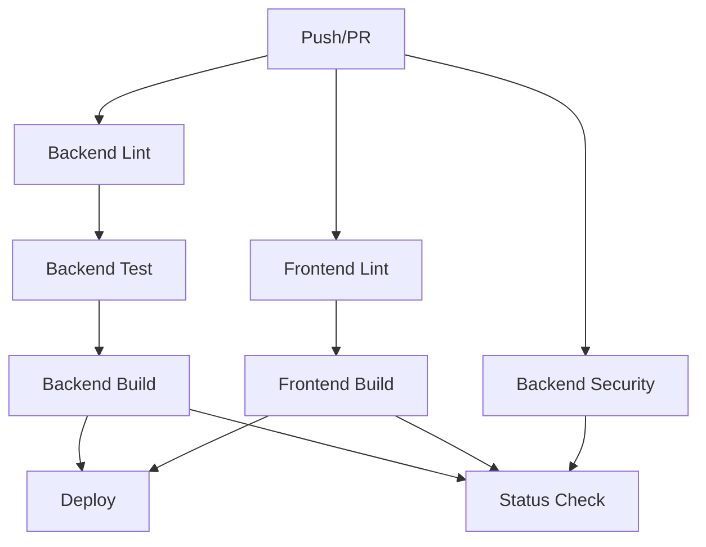

# 🚀 CI/CD Pipeline Documentation

This document describes the automated CI/CD pipelines for the SOPWriter project.

## 📋 Overview

Our CI/CD setup consists of 5 automated workflows:

1. **Main CI/CD Pipeline** (`ci.yml`) - Runs on every push and PR
2. **Security Scanning** (`security.yml`) - Weekly security audits + on-demand
3. **Dependency Review** (`dependency-review.yml`) - Checks dependency updates in PRs
4. **PR Automation** (`pr-automation.yml`) - Automates PR labeling and comments
5. **Release Pipeline** (`release.yml`) - Automated releases on tag push

---

## 🔄 Main CI/CD Pipeline

**File**: `.github/workflows/ci.yml`

### Triggers
- Push to `main` or `develop` branches
- Pull requests to `main` or `develop`
- Manual trigger via GitHub Actions UI

### Pipeline Architecture



### Jobs

#### 🔍 Backend Lint & Type Check
- **Runs**: ESLint, TypeScript type checking, Prettier
- **Duration**: ~1-2 minutes
- **Cache**: npm dependencies

#### 🧪 Backend Test (Matrix)
- **Node Versions**: 20, 22
- **Tests**: Unit tests, Integration tests
- **Coverage**: Generated for Node 20 only
- **Upload**: Coverage sent to Codecov
- **Duration**: ~3-5 minutes per version

#### 🏗️ Backend Build
- **Compiles**: TypeScript to JavaScript
- **Artifacts**: Uploads `dist` folder
- **Retention**: 7 days
- **Duration**: ~1-2 minutes

#### 🔒 Backend Security
- **Runs**: npm audit
- **Level**: Moderate and above
- **Runs in parallel** with other jobs

#### 🎨 Frontend Lint & Type Check
- **Runs**: ESLint, TypeScript build check
- **Duration**: ~1-2 minutes

#### 🎨 Frontend Build
- **Builds**: Production-ready Vite bundle
- **Artifacts**: Uploads `dist` folder
- **Retention**: 7 days
- **Duration**: ~2-3 minutes

#### 🚀 Deploy
- **Condition**: Only on `main` branch pushes
- **Environment**: Production
- **Steps**: Ready for configuration (Render, Vercel, etc.)

#### ✅ Status Check
- **Always runs** (even on failure)
- **Reports**: Overall CI/CD status
- **Fails**: If any critical job fails

### Configuration

To customize the pipeline, edit these environment variables in `ci.yml`:

```yaml
env:
  NODE_VERSION: '20'        # Default Node.js version
  CACHE_NAME: 'node-modules'
```

---

## 🔐 Security Scanning

**File**: `.github/workflows/security.yml`

### Triggers
- Push to `main` or `develop`
- Pull requests
- **Weekly**: Every Monday at 9 AM UTC
- Manual trigger

### Jobs

#### 🔐 CodeQL Analysis
- **Separate scans** for backend and frontend
- **Query Suites**: security-extended, security-and-quality
- **Languages**: JavaScript/TypeScript
- **Results**: Available in GitHub Security tab

#### 🔍 Dependency Vulnerability Scan
- **Scans**: Both backend and frontend dependencies
- **Level**: Moderate and above
- **Continues**: Even if vulnerabilities found (reports only)

#### 🔐 Secret Scanning
- **Tool**: TruffleHog OSS
- **Scans**: Entire git history
- **Reports**: Only verified secrets

### Viewing Results

1. Go to your repository's **Security** tab
2. Click on **Code scanning alerts** for CodeQL results
3. Click on **Dependabot alerts** for dependency issues

---

## 📦 Dependency Review

**File**: `.github/workflows/dependency-review.yml`

### Triggers
- Pull requests that modify `package.json` or `package-lock.json`

### Features
- ✅ Checks for vulnerability in new dependencies
- ✅ Validates licenses
- ✅ Fails PR if moderate+ severity vulnerabilities found
- ✅ Adds automatic comment to PR with results

### Configuration

```yaml
fail-on-severity: moderate  # Can be: low, moderate, high, critical
fail-on-scopes: runtime     # Can be: runtime, development, unknown
```

---

## 🤖 PR Automation

**File**: `.github/workflows/pr-automation.yml`

### Triggers
- PR opened, synchronized, or reopened

### Features

#### 🏷️ Auto Labeling
- Automatically adds labels based on files changed
- Uses `.github/labeler.yml` configuration

#### 📏 Size Calculation
- **XS**: 0-10 lines changed
- **S**: 11-100 lines
- **M**: 101-500 lines
- **L**: 501-1000 lines
- **XL**: 1000+ lines

#### 👋 Welcome Comment
- Adds helpful comment on first PR
- Lists automated checks
- Provides checklist

#### 📝 Commit Message Check
- Validates conventional commit format
- **Format**: `type(scope): description`
- **Types**: feat, fix, docs, style, refactor, perf, test, build, ci, chore, revert
- **Non-blocking**: Won't fail the PR

---

## 🎉 Release Pipeline

**File**: `.github/workflows/release.yml`

### Triggers
- Push tag matching `v*.*.*` (e.g., `v1.0.0`)
- Manual trigger with version input

### Process

1. **Build**: Compiles both backend and frontend
2. **Package**: Creates `.tar.gz` archives
3. **Changelog**: Auto-generates from git commits
4. **Release**: Creates GitHub Release with assets
5. **Docker** (optional): Builds and pushes Docker images

### Creating a Release

```bash
# Create and push a tag
git tag -a v1.0.0 -m "Release version 1.0.0"
git push origin v1.0.0

# The pipeline will automatically:
# 1. Build backend and frontend
# 2. Create release archives
# 3. Generate changelog
# 4. Create GitHub Release
```

### Manual Release

1. Go to **Actions** → **Release** workflow
2. Click **Run workflow**
3. Enter version (e.g., `v1.0.0`)
4. Click **Run workflow**

---

## 🎯 Best Practices

### For Developers

1. **Before Pushing**
   ```bash
   # Run these locally first
   npm run lint
   npm run typecheck
   npm test
   npm run build
   ```

2. **Commit Messages**
   - Use conventional commits: `feat:`, `fix:`, `docs:`, etc.
   - Keep commits atomic and focused
   - Write clear, descriptive messages

3. **Pull Requests**
   - Keep PRs small and focused
   - Ensure all CI checks pass
   - Address review comments promptly
   - Update documentation if needed

### For Maintainers

1. **Merging PRs**
   - Wait for all CI checks to pass
   - Require at least one approval
   - Use "Squash and Merge" for cleaner history

2. **Releases**
   - Follow semantic versioning (MAJOR.MINOR.PATCH)
   - Create detailed release notes
   - Test thoroughly before tagging

3. **Security**
   - Review security alerts weekly
   - Update dependencies regularly
   - Never commit secrets or tokens

---

## 🔧 Configuration Guide

### Setting up Deployment

#### Option 1: Render

1. Add secrets to GitHub repository:
   - `RENDER_API_KEY`
   - `RENDER_BACKEND_SERVICE_ID`
   - `RENDER_FRONTEND_SERVICE_ID`

2. Uncomment deployment step in `ci.yml`:
   ```yaml
   - name: 🚀 Deploy Backend to Render
     uses: johnbeynon/render-deploy-action@v0.0.8
     with:
       service-id: ${{ secrets.RENDER_BACKEND_SERVICE_ID }}
       api-key: ${{ secrets.RENDER_API_KEY }}
   ```

#### Option 2: Vercel (Frontend)

1. Add secrets:
   - `VERCEL_TOKEN`
   - `VERCEL_ORG_ID`
   - `VERCEL_PROJECT_ID`

2. Uncomment in `ci.yml`:
   ```yaml
   - name: 🚀 Deploy to Vercel
     uses: amondnet/vercel-action@v25
     with:
       vercel-token: ${{ secrets.VERCEL_TOKEN }}
       vercel-org-id: ${{ secrets.VERCEL_ORG_ID }}
       vercel-project-id: ${{ secrets.VERCEL_PROJECT_ID }}
   ```

#### Option 3: Custom Deployment

Add your deployment script:
```yaml
- name: 🚀 Custom Deploy
  run: |
    # Your deployment commands here
    ./deploy.sh
  env:
    DEPLOY_KEY: ${{ secrets.DEPLOY_KEY }}
```

### Adding Codecov Integration

1. Sign up at [codecov.io](https://codecov.io)
2. Add `CODECOV_TOKEN` to repository secrets
3. Coverage is uploaded automatically (no changes needed)

### Setting up Branch Protection

1. Go to **Settings** → **Branches**
2. Add rule for `main` branch:
   - ✅ Require status checks to pass
   - ✅ Require branches to be up to date
   - Select required checks:
     - `Backend - Lint & Type Check`
     - `Backend - Test`
     - `Backend - Build`
     - `Frontend - Lint & Type Check`
     - `Frontend - Build`
   - ✅ Require pull request reviews (1+)

---

## 📊 Monitoring & Metrics

### GitHub Actions Dashboard
- View all workflow runs: **Actions** tab
- Filter by workflow, branch, or status
- Download logs for debugging

### CI/CD Metrics
- **Success Rate**: Track in Actions tab
- **Build Times**: Review job durations
- **Test Coverage**: Check Codecov dashboard

### Notifications
GitHub will notify you about:
- ✅ Successful deployments
- ❌ Failed workflows
- 🔒 Security alerts
- 📦 Dependency updates

---

## 🐛 Troubleshooting

### Common Issues

#### ❌ Tests Failing in CI but Pass Locally

**Cause**: Environment differences

**Solution**:
```bash
# Run tests with same settings as CI
NODE_ENV=test npm test
```

#### ❌ npm ci Fails

**Cause**: `package-lock.json` out of sync

**Solution**:
```bash
npm install
git add package-lock.json
git commit -m "chore: update package-lock.json"
```

#### ❌ Build Artifacts Not Found

**Cause**: Build failed or path incorrect

**Solution**: Check build logs, ensure `dist` folder is created

#### ❌ Codecov Upload Fails

**Cause**: Token not set or invalid

**Solution**:
1. Verify `CODECOV_TOKEN` secret
2. Check coverage file exists: `coverage/coverage-final.json`

### Getting Help

- 📖 Check workflow logs in Actions tab
- 🐛 Open an issue with logs and error messages
- 💬 Ask in discussions or team chat

---

## 📚 References

- [GitHub Actions Documentation](https://docs.github.com/en/actions)
- [Node.js Best Practices](https://github.com/goldbergyoni/nodebestpractices)
- [Conventional Commits](https://www.conventionalcommits.org/)
- [Semantic Versioning](https://semver.org/)

---

## 🔄 Changelog

### Latest Changes (Dec 2025)
- ✨ Complete pipeline redesign with cleaner architecture
- ✨ Added frontend CI/CD support
- ✨ Implemented security scanning with CodeQL
- ✨ Added PR automation and auto-labeling
- ✨ Created automated release pipeline
- ✨ Improved caching and parallel execution
- 🐛 Fixed dependency issues

---

<p align="center">
  <strong>Made with ❤️ for clean, automated workflows</strong>
</p>
